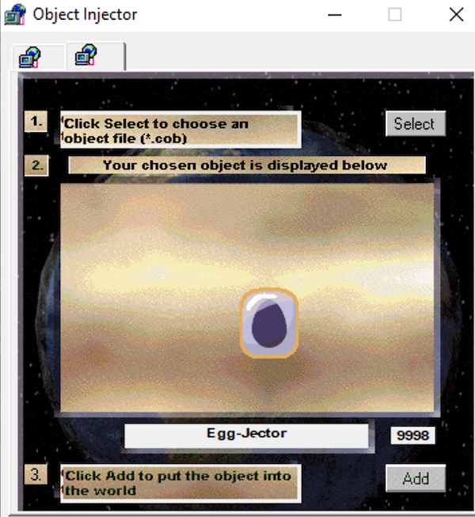
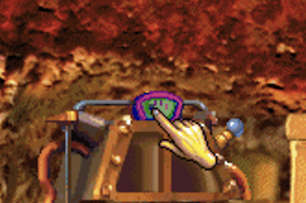
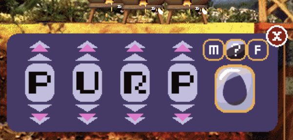
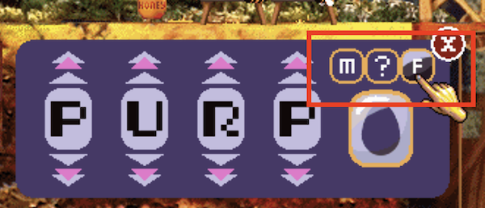
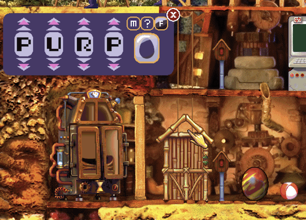
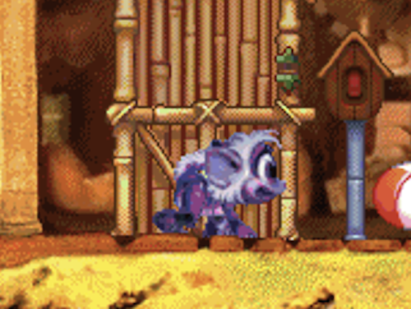

# Poor Man's C1 Pigment Bleed

This guide shows a way to generate genomes for Creatures with pigment bleed
which are not available through the genetics kit in Creatures 1

In this guide we will preview the effects of pigment and pigment bleed

This guide utilizes the command line. It is available on Windows, macOS and Linux/Ubuntu

## The Command Line Apps

For this tutorial you will need 
- The `render-creature` app available on the 
[Render Creature GitHub page](https://github.com/bedalton/Creatures-BreedRenderer-CLI/releases)
- The `breed-utility` app available on the 
[Breed Utility GitHub releases page](https://github.com/bedalton/Creatures-BreedUtil-CLI/releases)
- **For C1 Only**, the 
[C1 EggJector COB](https://eem.foo/archive/downloads/64c0)

## Short(ish) version
1. Install Files
   1. Copy the `render-creature`, `breed-util` binaries (downloaded above) to your Creatures folder
   2. **C1 Only** - From the C1 EggJector Zip file
      1. Copy COB/RCB files into your Creatures 1 folder
      2. Copy the SPR file into C1 images folder
2. [Open command prompt (Windows)](#open-command-prompt-command-line-window) / [open Terminal (macOS)](#open-terminal)
3. Change current working directory to the main game folder for the Creatures game to use 
   1. type `cd ` followed by a space
   2. Drag your Creatures folder into the command prompt/terminal window
   3. Press enter
4. Paste the following command
   1. Replace `{OUTPUT_FILE_NAME}.png` with desired output PNG location
      - Shown below with path `output\image.png`
   2. Replace `{GENDER}` with `m`/`male` for male, or `f`/`female` for female
      - Shown below with `--gender f`
   3. replacing `{BREED}`, with a breed, using a value `n:0`-`n:9` for C1 or `n:a`-`n:z`, for norn and slot.
      - Shown below with `--breed n:1` for C1 Pixie Norn
   4. Replace `{GENOME}` with path to genetics file, ending in `.gen`. `Genetics\mum2.gen` was used for example command below
      - Shown with "Genetics\mum2.gen"
      
```SHELL
# Windows
render-creature {OUTPUT_FILE_NAME}.png "Images" "Body Data" --age 4 --gender {GENDER} --breed {BREED} --tint rand --swap rand --rotation rand --pose front --genome {GENOME} --open --print-alter-genome-command
# macOS / unix
render-creature {OUTPUT_FILE_NAME}.png "Images" "Body Data" --age 4 --gender {GENDER} --breed {BREED} --tint rand --swap rand --rotation rand --pose front --genome {GENOME}--open --print-alter-genome-command
```  

C1 Example:
```SHELL
render-creature Outputs\image.png "Images" "Body Data" --age 4 --gender f --breed n:1 --tint rand --swap rand --rotation rand --pose front --genome "Genetics\mum2.gen" --open --print-alter-genome-command
```

5. Hit enter
6. If you like the rendered image, continue to step 7. If not:
   1. Click back into terminal/command prompt window
   2. Press `up-arrow` to show the last command
   3. Hit `enter` to generate new image
   4. ...Repeat until you like what you see
7. Copy the generated command beginning with `breed-util`, and paste it back into command prompt  
   - Example: 
   ```
   breed-util alter-genome --breed norn:1 --red 105 --green 217 --blue 208 --swap 0 --rotation 255
   ```
8. **Add Genome Name**
   1. Add a space after the pasted command
      2. Add the output genome name prefixed with "Genetics\\", followed by `.gen`
        - C1/C2 - genome file name exactly  (i.e. `pink.gen`)
         or genome name prefixed with genus type (i.e. `norn.pink.gen`), beginning with "Genetics\\" and ending with ".gen"
         - C1/C2 Example: `Genetics\pink.gen`
         - C3/DS Example: `Genetics\norn.pink.gen`
```SHELL
breed-util alter-genome --breed n:1 --red 105 --green 217 --blue 208 --swap 0 --rotation 255 "Genetics\pink.gen"
```
9. **Inject Egg** 
  - [C1 injection method](#5-injecting-the-egg---c1) 
  - Genetics kit for C2/C3DS

## Long Detailed Version
**Choosing your colors**

To preview a genome requires the `render-creature` command.
This command comes with many options, most of which will not be needed

If you are not familiar with the command line, see the [command line basics](#appendix-command-line-basics) section

To started download the `render-creature` and `breed-utility` binaries. For easiest use, place in your
Creatures directory.

### 1. Open Command Prompt

Open a command prompt [see open Command Prompt (Windows)](#open-command-prompt-command-line-window) 
or [Open Terminal (macOS)](#open-terminal).

**If unable to open on macOS** [see Gatekeeper](#gatekeeper) sections for instructions

--------

### 2. Set Current Working Directory
If you copied your executable to your Creatures 1, 2 or C3, or DS main folder
You would set your current working directory to your main Creatures folder for that game. 
([see current working directory appendix](#current-working-directory))

--------

### 3. Rendering Preview

#### 1. Required Arguments:
**No `--` prefix**

**1. Files**  
To render you will need to provide the output image path, and add the folders with the required
Sprite and ATT files needed to render your breed. This is usually your 
root `Images` and `Body Data` folders.

**Important: The output file must come before the image and sprite directories** 

We start with the command `render-creature` then add our images paths
If they are not located in your current working directory, drag them one by one into
the command line window. 
If typing in your folders, remember to add quotations around folders with spaces.  
*If you drag your folders in, they will not need quotations as paths will be quoted on windows and escaped on macOS,
and most likely Linux/Ubuntu* 

```SHELL
render-creature output/image.png "Images" "Body Data"
```

#### 2. Required Options
**Options can come in any order after the files.**  
**Use the `--{option}` format, and add a value if required**  
All renders require:
  - `--age {value}`
  - `--gender {value}`
  - `--breed {value}` `{genus}:{slot}`. I.e. `norn:1` or `n:1`
    - `g:1` - is Grendel 1, not Geat. Use `s` for geat/shee

```SHELL
render-creature output/image.png "Images" "Body Data" --age 4 --gender f --breed n:1
```

*If `--breed` is not used, you must supply **all** available body part options, 
- `--head`
- `--body`
- `--legs`
- `--arms`
- `--tail` (C2 or above)
- `--hair`*(Optional if using CV, (Untested)*  

If `--breed` is defined, individual parts can be overwritten using any desired options listed above (or none), in any order `--breed n:2 --head n:1`

#### 3. Color Options
Defining colors.   
**All values are `0`-`255` or `rand`**.   
With default being 128, meaning no color change applied, 
and `rand` to have a random value generated, `0`-`255`  
Options: 
- `--tint {r:g:b}` - `--tint ` followed by a space then red, green and blue value separated by `:` (colon) and no spaces.
  - Example: `--tint 255:0:0` This would apply full red, and remove as much blue and green as allowed by the engine.
- `--swap {value}` - The amount of swap to apply. Swap swaps the blue and red color values
  - Example: `--swap 255` - Apply the full amount of swap possible
- `--rotation {value}` - Shift color values `red -> green -> blue ->red` if above 128 or `red -> blue -> green -> red` if below 128


Though colors can be individually set as described above, sometimes random values can help you discover new combinations

```SHELL
render-creature output/image.png "Images" "Body Data" --age 4 --gender f --breed n:1 --tint rand --swap rand --rotation rand
```

#### 4. Pose Option
- `--pose` - followed by:
  - a 15 character pose string
  - `rand` - for a random pose (usually messed up and bizarre
  - A direction for a standard pose with arms down looking forward
    - `front`
    - `back`
    - `left`
    - `right`
  - Example: `--pose front` - standing straight up facing front
  - Example: `--pose 212222222111112` - standing straight up, facing right
  - Example: `--pose rand` - A pose with a random direction, and random limb tilts
  
```SHELL
# macOS/Linux
render-creature output/image.png  "Images" "Body Data" --age 4 --gender f --breed n:1 --tint rand --swap rand --rotation rand --pose front
```

#### 5. Genome Option 
Colors on genomes vary depending on the genome used, especially on C1. 
After selecting a genome, you should pass it to the command using
- `--genome {genome_path}` - Path to genome including `.gen` file extension  
  - Example: `--genome Genetics\mum1.gen`  
  
```SHELL
# macOS/Linux
render-creature output/image.png  "Images" "Body Data" --age 4 --gender f --breed n:1 --tint rand --swap rand --rotation rand  --pose front --genome Genetics\mum1.gen
```

#### 6. Helper Options  
These are flag options. They take no value. So just put `--open`, **do not put** `--open true`
- `--open` \[flag\] - This option will opent the image file after generating, without having to navigate 
and open the file yourself.
- `--print-alter-genome-command`  \[flag\] - Generate a command that can be passed to the render `breed-util` to generate a creature
When using this command, you must also add an output filename
- `--loop`  \[flag\]  - *Optional* generate a new image after hitting enter when in terminal
  - Type `no` to end loop
- If not looping, press up to reload the last command, and press enter

```SHELL
# macOS/Linux
render-creature output/image.png  "Images" "Body Data" --age 4 --gender f --breed n:1 --tint rand --swap rand --rotation rand --pose front --genome Genetics\mum1.gen --open --print-alter-genome-command
# Windows
render-creature output\image.png "Images" "Body Data" --age 4 --gender f --breed n:1 --tint rand --swap rand --rotation rand --pose front --genome Genetics\mum1.gen --open --print-alter-genome-command 
```

#### 7. Render
Hit enter after setting all options, and open image. If using `--open`, image will open automatically.   
- **--loop**
If using `--loop` and the color is not what you want, 
1. close the image, 
2. click back in command prompt/terminal, 
3. Hit enter again.  
4. When satisfied, type `no`

- **No loop** With loop,   
If not using loop:
1. Close image
2. Click back in command prompt/terminal
3. Press up arrow
4. Hit enter

After generating an image you like, loop at the output line beginning with `breed util` 


--------

### 4. Generate Genome

After finding a render I liked, the command generated by `render-creature` is:
```SHELL
breed-util alter-genome  "Genetics\mum1.gen" --breed norn:1 --red 184 --green 93 --blue 211 --swap 151 --rotation 234
```

To actually make the genome, copy and paste this command into the command prompt/terminal,
followed by the output file name.
Remember to place the genome in your "Genetics folder"
Shown here with the file `Genetics\prpl.gen`

In C1/C2 genomes are 4 alpha-numeric characters. Though punctuation may be allowed
The C1 EggJector does not support it

```SHELL
breed-util alter-genome  "Genetics\mum1.gen" --breed norn:1 --red 184 --green 93 --blue 211 --swap 151 --rotation 234 "Genetics\prpl.gen"
```

--------

### 5. Injecting the Egg - C1
On C2+ you can make an egg, or use the genome editor to inject the genome

On C1, pigment bleed genes are defined in the pigments gene-extra block, which is not
supported by the Genetics Kit. This means you genome will not open in it, and cannot be injected
by it.

That is where the C1-EggJector comes in.

Move the `SPR` file into your images folder, and your COB and RCB file whever you keep them. 
Most cases, the root C1 folder

1. Open the game, and inject the `Egg Jector` COB with the Agent Injector.   
*Note: You must have at least one norn in your game to open the agent injector*  

2. Navigate to Incubator, and click on the gauge at the top of the incubator  
It will light up purple when it is ready to be clicked.  

3. Set the four character values to your 4-letter genome name.
   - Click the top and bottom double arrows to jump by 6 letters in the alphabet
   - Single arrows to move by 1 <br/>

4. Set egg gender  

5. Double check that genome is in genetics folder
  - **If genome file is not in folder, it can destroy your world**
  - **Double/Triple check it is in there.** 
  - If you left out the `Genetics\` output file prefix, the genome is NOT in your genetics folder.
  - **Again, can destroy WORLD if genome does not exist**  
6. Click the purple egg to inject  

7. Enjoy new creature  


--------

## Appendix: Command Line Basics

### Input Files: Paths

Paths can be relative to the [current working directory](#current-working-directory) or absolute.  
On windows paths are separated with `\\`. When viewing examples, keep this in mind

Any time a file or folder is needed, you may drag one into the command line window

### Current Working Directory

**Current working directory** is the path your terminal or Command Prompt thinks you are.

- Usually when starting a command prompt or terminal, this is your **HOME** directory
- **This is not usually the folder you have open** or are viewing when you open the command prompt.
- To Navigate to the folder you want, us `cd ` (plus a space)
    - then enter/paste the absolute path to the folder
        - `c:/MyFolder` or `"/Users/{myname}/My Folder"`
    - **drag** the folder from explore,finder, etc. into the CMD or Terminal window
    - If typing in a folder with a space, surround it with quotation marks

### Arguments

Arguments are values that are defined by their position.  
They do not use a prefix they are simply used.   
In this README, they will be surrounded by `{` and `}`  
i.e. `breed-util convert-breed {game-target}`

- `breed-util convert-breed` is entered as is,
- `{game-target}` must be substituted by the target game
- Example: `breed-util convert-breed C2`

### Options

come after the `breed-util` command and its subcommand, and come in two flavors

#### Regular Options

Most options are followed by a value i.e. `--input-genus norn`.

- Here the *option* is `--input-genus` and the *value* is `norn`

##### Flags

Flags take **no arguments**, and represent a **true** value to the flag

- Flags take no argument so do not put `yes` or `no` after it
- **Using a flag** = **true**; Presence of a flag, means that value is true or enabled
- **No flag** = **false**; Absence of flag means that value is false

---

## Appendix: macOS

### Open Terminal

You can open terminal through [spotlight](#open-terminal-from-spotlight) or [Finder](#open-terminal-through-finder)

#### Open Terminal From Spotlight

1. Open Spotlight
- Shortcut Key - `CMND+SPACE`
- OR Click the magnifying-glass icon on the menubar in the upper right
2. Type in `Terminal`
3. Select `Terminal.app` and hit enter
4. \[Optional] Set your current working directory if desired using `cd` (see [current working directory](#current-working-directory))

#### Open Terminal Through Finder

1. Open Finder
2. Open the `Applications` Folder
3. Open the `Utilities` folder
4. Double Click `Terminal.app`
5. \[Optional] Set your current working directory if desired using `cd` (see [current working directory](#current-working-directory))

### GATEKEEPER

MacOS may prevent you from opening the executable as the binary is not signed

#### Allow Program in Terminal

1. copy and paste `xattr -d com.apple.quarantine `
2. Add a space after it
3. Drag the `breed-util` executable into the folder and hit enter
4. Enter password if prompted

#### Allow Program in System Setting

1. Open System Settings
2. On the left side find `Privacy and Security`
3. Find `Security`
4. Click `Open Anyways`
5. Enter Password if prompted

## Appendix: Windows
### Open Command Prompt (command line window)
1. Click the search bar next to the windows icon
2. Type `CMD`
3. Click `Command Prompt`
4. \[Optional] Set your current working directory if desired using `cd` (see [current working directory](#current-working-directory)) 

